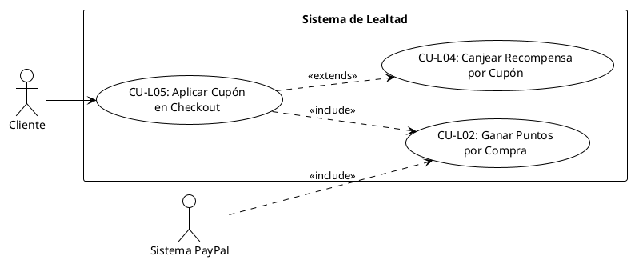

# CU-L05 – Aplicar Cupón en Checkout

## Diagrama de Caso de Uso

## Especificación del Caso de Uso

| **Campo**         | **Descripción**                                                                                                                                                                                                                                                                                                                                                                                                                                                                                                                                                                                                                                                                                      |
| ----------------- | ---------------------------------------------------------------------------------------------------------------------------------------------------------------------------------------------------------------------------------------------------------------------------------------------------------------------------------------------------------------------------------------------------------------------------------------------------------------------------------------------------------------------------------------------------------------------------------------------------------------------------------------------------------------------------------------------------- |
| **Caso de uso**   | CU-L05 – Aplicar Cupón en Checkout                                                                                                                                                                                                                                                                                                                                                                                                                                                                                                                                                                                                                                                                   |
| **Propósito**     | • Permitir al cliente aplicar un cupón de descuento (generado por lealtad u otro) en el proceso de checkout, validando su vigencia y ajustando el descuento para cumplir con los requisitos de PayPal.                                                                                                                                                                                                                                                                                                                                                                                                                                                                                               |
| **Actores**       | • Cliente autenticado                                                                                                                                                                                                                                                                                                                                                                                                                                                                                                                                                                                                                                                                                |
| **Iniciador**     | • Cliente                                                                                                                                                                                                                                                                                                                                                                                                                                                                                                                                                                                                                                                                                            |
| **Precondición**  | • El usuario debe estar autenticado • El carrito debe tener productos • El cupón debe existir y estar activo • El cupón no debe haber alcanzado su límite de usos                                                                                                                                                                                                                                                                                                                                                                                                                                                                                                                           |
| **Flujo**         | **Vista de Checkout** 1. El cliente ingresa el código del cupón en el campo correspondiente 2. El cliente hace clic en "Aplicar Cupón" 3. El sistema busca el cupón en la base de datos 4. El sistema valida que el cupón esté activo y no expirado 5. El sistema verifica que el cupón no haya alcanzado su límite de usos 6. El sistema calcula el total del carrito 7. El sistema calcula el descuento según el tipo de cupón 8. Si el total después del descuento es menor a $1: &nbsp;&nbsp;&nbsp;• El sistema ajusta el descuento para dejar mínimo $1 9. El sistema guarda el descuento en la sesión 10. El sistema muestra el descuento aplicado al cliente |
| **Postcondición** | • El descuento se aplica al total del carrito • El descuento se guarda en la sesión • El total final es al menos $1 USD para PayPal                                                                                                                                                                                                                                                                                                                                                                                                                                                                                                                                                            |
| **Excepción**     | • El cupón no existe • El cupón está expirado o inactivo • El cupón alcanzó su límite de usos • El monto mínimo no se cumple • Error al calcular el descuento                                                                                                                                                                                                                                                                                                                                                                                                                                                                                                                            |
