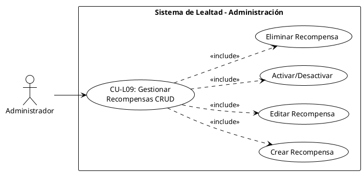

# CU-L09 – Gestionar Recompensas CRUD

## Diagrama de Caso de Uso

## Especificación del Caso de Uso

| **Campo**         | **Descripción**                                                                                                                                                                                                                                                                                                                                                                                                                                                                                                                                                                                                                                                                                                                                                                                                                                                                                                                                                                                                                                                                                                                         |
| ----------------- | --------------------------------------------------------------------------------------------------------------------------------------------------------------------------------------------------------------------------------------------------------------------------------------------------------------------------------------------------------------------------------------------------------------------------------------------------------------------------------------------------------------------------------------------------------------------------------------------------------------------------------------------------------------------------------------------------------------------------------------------------------------------------------------------------------------------------------------------------------------------------------------------------------------------------------------------------------------------------------------------------------------------------------------------------------------------------------------------------------------------------------------- |
| **Caso de uso**   | CU-L09 – Gestionar Recompensas CRUD                                                                                                                                                                                                                                                                                                                                                                                                                                                                                                                                                                                                                                                                                                                                                                                                                                                                                                                                                                                                                                                                                                     |
| **Propósito**     | • Permitir al administrador crear, editar, activar/desactivar y eliminar recompensas del programa de lealtad, controlando qué beneficios están disponibles para los clientes.                                                                                                                                                                                                                                                                                                                                                                                                                                                                                                                                                                                                                                                                                                                                                                                                                                                                                                                                                           |
| **Actores**       | • Administrador                                                                                                                                                                                                                                                                                                                                                                                                                                                                                                                                                                                                                                                                                                                                                                                                                                                                                                                                                                                                                                                                                                                         |
| **Iniciador**     | • Administrador                                                                                                                                                                                                                                                                                                                                                                                                                                                                                                                                                                                                                                                                                                                                                                                                                                                                                                                                                                                                                                                                                                                         |
| **Precondición**  | • El usuario debe tener rol de administrador • El usuario debe estar autenticado                                                                                                                                                                                                                                                                                                                                                                                                                                                                                                                                                                                                                                                                                                                                                                                                                                                                                                                                                                                                                                                     |
| **Flujo**         | **Crear Recompensa** 1. El administrador accede a la configuración de lealtad 2. El administrador hace clic en "Nueva Recompensa" 3. El sistema muestra el formulario vacío 4. El administrador completa los campos requeridos 5. El sistema valida los datos 6. El sistema guarda la imagen (si existe) 7. El sistema crea la recompensa en la base de datos  **Editar Recompensa** 1. El administrador hace clic en el botón "Editar" 2. El sistema carga los datos actuales en el formulario 3. El administrador modifica los campos deseados 4. El sistema valida los datos 5. El sistema actualiza la imagen (si cambió) 6. El sistema actualiza la recompensa  **Activar/Desactivar** 1. El administrador hace clic en el botón toggle 2. El sistema cambia el estado is_active 3. El sistema guarda el cambio  **Eliminar Recompensa** 1. El administrador hace clic en "Eliminar" 2. El sistema solicita confirmación 3. El sistema verifica que no tenga canjes asociados 4. El sistema elimina la imagen 5. El sistema elimina la recompensa |
| **Postcondición** | • La recompensa es creada/editada/eliminada según la operación • Los cambios se reflejan en el catálogo de recompensas • Se registra la acción en el sistema                                                                                                                                                                                                                                                                                                                                                                                                                                                                                                                                                                                                                                                                                                                                                                                                                                                                                                                                                                      |
| **Excepción**     | • Datos inválidos en el formulario • Imagen demasiado grande (>2MB) • Error al guardar en la base de datos • Intentar eliminar recompensa con canjes activos • Permisos insuficientes                                                                                                                                                                                                                                                                                                                                                                                                                                                                                                                                                                                                                                                                                                                                                                                                                                                                                                                                       |
