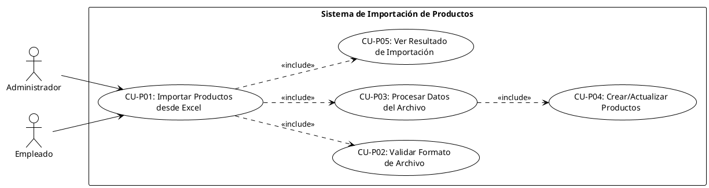

# CU-P01 – Importar Productos desde Excel

## Diagrama de Caso de Uso

## Especificación del Caso de Uso

| **Campo**         | **Descripción**                                                                                                                                                                                                                                                                                                                                                                                                                                                                                                                                                                                                                                                                                                                                                                                                                                                                                                                                                                                                                                                                    |
| ----------------- | ---------------------------------------------------------------------------------------------------------------------------------------------------------------------------------------------------------------------------------------------------------------------------------------------------------------------------------------------------------------------------------------------------------------------------------------------------------------------------------------------------------------------------------------------------------------------------------------------------------------------------------------------------------------------------------------------------------------------------------------------------------------------------------------------------------------------------------------------------------------------------------------------------------------------------------------------------------------------------------------------------------------------------------------------------------------------------------- |
| **Caso de uso**   | CU-P01 – Importar Productos desde Excel                                                                                                                                                                                                                                                                                                                                                                                                                                                                                                                                                                                                                                                                                                                                                                                                                                                                                                                                                                                                                                            |
| **Propósito**     | • Permitir a administradores y empleados importar múltiples productos de forma masiva desde un archivo Excel, facilitando la carga inicial de inventario y actualizaciones masivas.                                                                                                                                                                                                                                                                                                                                                                                                                                                                                                                                                                                                                                                                                                                                                                                                                                                                                                |
| **Actores**       | • Administrador • Empleado                                                                                                                                                                                                                                                                                                                                                                                                                                                                                                                                                                                                                                                                                                                                                                                                                                                                                                                                                                                                                                                      |
| **Iniciador**     | • Administrador o Empleado                                                                                                                                                                                                                                                                                                                                                                                                                                                                                                                                                                                                                                                                                                                                                                                                                                                                                                                                                                                                                                                         |
| **Precondición**  | • El usuario debe estar autenticado • El usuario debe tener permisos de gestión de productos • El archivo debe estar en formato Excel (.xlsx, .xls) • Las categorías y marcas referenciadas deben existir                                                                                                                                                                                                                                                                                                                                                                                                                                                                                                                                                                                                                                                                                                                                                                                                                                                                 |
| **Flujo**         | **Vista de Importación** 1. El usuario accede a la sección de importación de productos 2. El usuario selecciona un archivo Excel de su computadora 3. El usuario hace clic en "Importar" 4. El sistema valida el formato y tamaño del archivo (máx 10MB) 5. El sistema lee el archivo Excel fila por fila 6. Para cada fila: &nbsp;&nbsp;&nbsp;a. El sistema valida los datos (SKU, nombre, precio, stock, etc.) &nbsp;&nbsp;&nbsp;b. El sistema busca la categoría y marca por nombre &nbsp;&nbsp;&nbsp;c. El sistema busca si el producto existe por SKU &nbsp;&nbsp;&nbsp;d. Si existe: actualiza los datos &nbsp;&nbsp;&nbsp;e. Si no existe: crea un nuevo producto &nbsp;&nbsp;&nbsp;f. Si hay errores: agrega a la lista de errores 7. El sistema genera un resumen con: &nbsp;&nbsp;&nbsp;• Total de filas procesadas &nbsp;&nbsp;&nbsp;• Productos creados exitosamente &nbsp;&nbsp;&nbsp;• Productos actualizados &nbsp;&nbsp;&nbsp;• Errores encontrados con detalles 8. El sistema muestra el resumen al usuario |
| **Postcondición** | • Los productos válidos son creados o actualizados en la base de datos • Se genera un reporte de importación • Los errores son reportados al usuario                                                                                                                                                                                                                                                                                                                                                                                                                                                                                                                                                                                                                                                                                                                                                                                                                                                                                                                         |
| **Excepción**     | • Archivo con formato inválido • Archivo demasiado grande (>10MB) • Datos faltantes o inválidos en las filas • Categoría o marca no encontrada • SKU duplicado en el archivo • Error de conexión a la base de datos • Permisos insuficientes                                                                                                                                                                                                                                                                                                                                                                                                                                                                                                                                                                                                                                                                                                                                                                                                                     |
