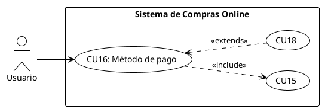

# CU16 – Compras Online

## Diagrama de Caso de Uso

## Especificación del Caso de Uso

| **Campo**         | **Descripción**                                                                                                                                                                                                            |
| ----------------- | -------------------------------------------------------------------------------------------------------------------------------------------------------------------------------------------------------------------------- |
| **Caso de uso**   | CU16 – Compras Online                                                                                                                                                                                                      |
| **Propósito**     | • Permitir a cualquier usuario (autenticado) poder realizar su pago con diferentes métodos (QR, PayPal, Efectivo) y garantizar el control de las transacciones, mejorando la eficiencia en los pagos, para los usuarios.   |
| **Actores**       | • Usuario en general                                                                                                                                                                                                       |
| **Iniciador**     | • Usuario                                                                                                                                                                                                                  |
| **Precondición**  | • Requiere autenticación • Los productos deben estar cargados y al igual que debe estar la información del usuario.                                                                                                     |
| **Flujo**         | **Vista de Pago** • El usuario debe haber cargado sus productos al carrito. • El usuario debe rellenar los datos de envío de su producto. • El sistema validará su método de pago y si tiene el saldo suficiente. |
| **Postcondición** | • El método de pago quedará registrado en la bitácora.                                                                                                                                                                     |
| **Excepción**     | • No tenga productos en su carrito de compras. • No haya brindado todos sus datos. • No cuente con el monto de pago.                                                                                                 |
